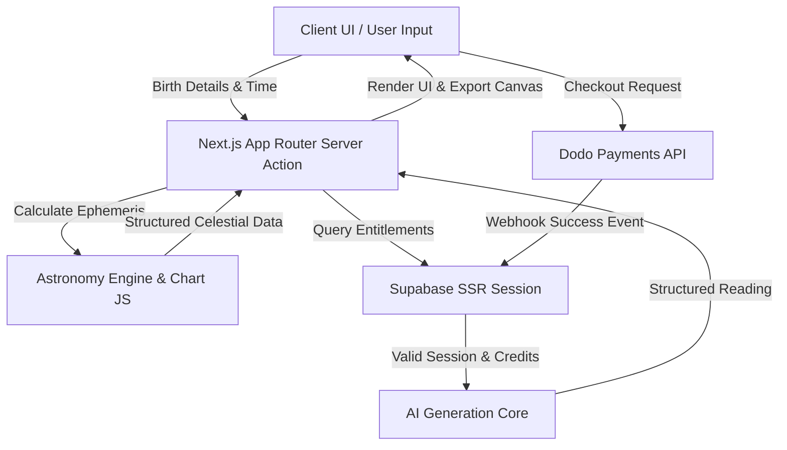

# astraten_AIAPP_showcase
i built AI zodiac app astraten, this is first public project for poeple to use and it was quite successfull, it become popular in my country. people started asking questions look for answers and has big satisfaction rate. it spread with power of "word of mouth" and has growing users.  2200 and counting. 

# 🌌 astraten — Astrological Intelligence & Compatibility Platform

> **Showcase Repository**: This public repository serves as a portfolio demonstration of the architecture, UI system, and technical patterns behind **astraten**. Proprietary system prompts, production secrets, and direct payment Webhooks have been sanitized and mocked for public viewing.

---

## 🛠️ Tech Stack & Badges

---

## 🚀 Architectural Overview

astraten combines high-precision astronomical mechanics with generative AI to calculate natal charts, interpret planetary aspects, and compute synastry compatibility models.

## 📱 Product Showcase

| 💬 AI Chat & Interpretations | 👤 Saved Profiles & Charts |
| :---: | :---: |
|  |  |
| *Real-time AI astrology assistant & reading output* | *User natal chart storage & profile management* |

---

### 🔮 Compatibility & Readings Overview

  
   
  <em>Synastry compatibility scoring and detailed astrological analysis dashboard</em>

