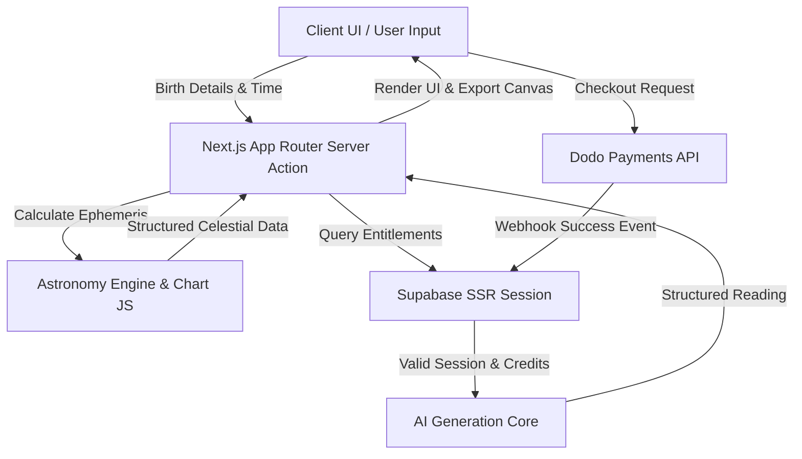
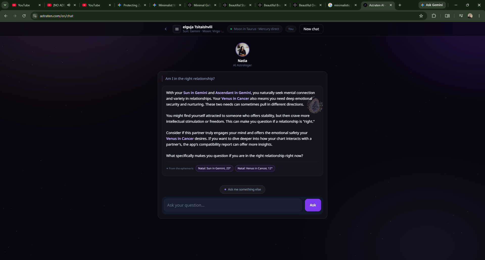
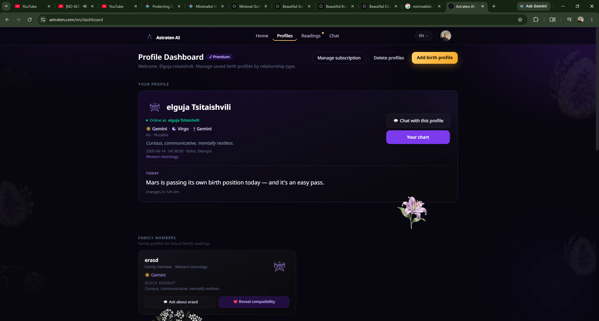
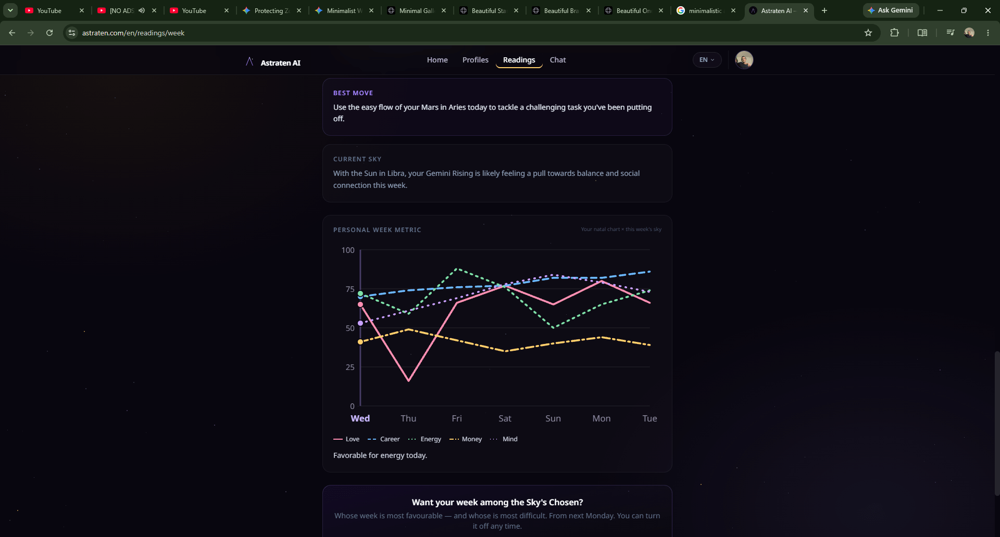

# astraten_AIAPP_showcase
i built AI zodiac app astraten, this is first public project for poeple to use and it was quite successfull, it become popular in my country. people started asking questions look for answers and has big satisfaction rate. it spread with power of "word of mouth" and has growing users.  2200 and counting. 

# 🌌 astraten — Astrological Intelligence & Compatibility Platform

> **Showcase Repository**: This public repository serves as a portfolio demonstration of the architecture, UI system, and technical patterns behind **astraten**. Proprietary system prompts, production secrets, and direct payment Webhooks have been sanitized and mocked for public viewing.

---

## 🛠️ Tech Stack & Badges

---

## 🚀 Architectural Overview

astraten combines high-precision astronomical mechanics with generative AI to calculate natal charts, interpret planetary aspects, and compute synastry compatibility models.

## 📱 Product Showcase

| 💬 AI Chat & Interpretations | 👤 Saved Profiles & Charts |
| :---: | :---: |
|  |  |
| *Real-time AI astrology assistant & reading output* | *User natal chart storage & profile management* |

---

### 🔮 Compatibility & Readings Overview

  
   
  <em>Synastry compatibility scoring and detailed astrological analysis dashboard</em>

entered user can create his main (self) profile, his ftiends or familiy members profile nad then do following operations: compatibility analysis, week analysis, career, Zodiac man... 
based on their horoscope. with this analyses, there were visual representations too. of overall week energy, love, money, career, mind flow. this weeks sky from users geographical locations perspective. 
readings are mix of AI astrological inteligence and deterministic mathematical calculations which leads to pure visual representations. this created really good user experiecne. 

astraten got 2200+ users in just 3 months. i was marketing with instagram when i was free but mostly spread by word of mouth, in georiga. its a pure production lvl digital product, which has been sold to users online, managed to become profitable. 
i built subscription feature with gate. nonpremium user has gate and only one compatibility reading and 3 AI chat message in a week. users card information is hadlned by dodopayments. which i built webhook infrastructure payment to be safe, consistent and fast. 

user data is saved and controlled via supabase API. i wanted database to be as fast as i could so i implented normalisations and indexing. when i work with the project i always imagine scenarios of how would senior lvl engineer  solve this problem, also if app was ment to be scaled. 
since bc of that my features have real life scenario basis intuition and building approach. i normilised tables to don't have anomalies and data dublicates, and indexed. actually which i have learned well in my university curse of postgresSQL databases. i have mastered how data is saved physically. 
what datastrucutre is most compatible. if i make reads fast what will be effect on writing. and so on. 

